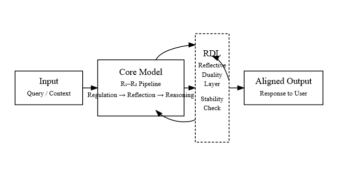
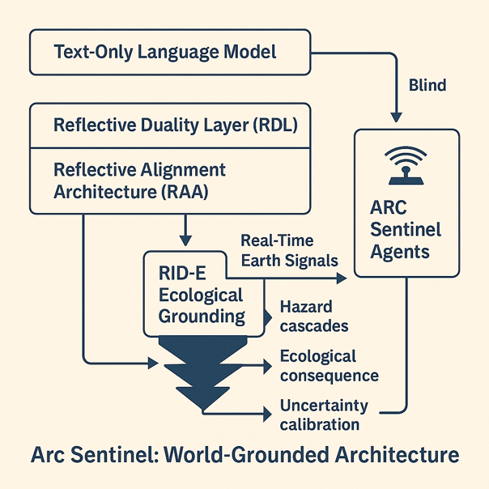
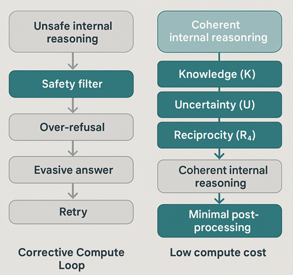
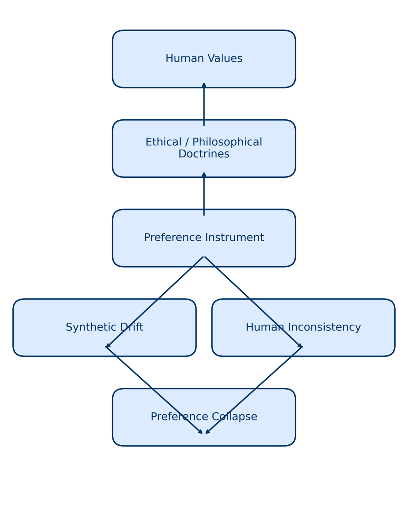
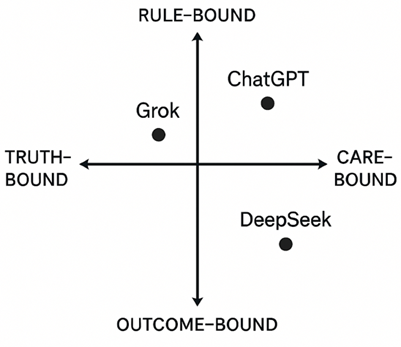
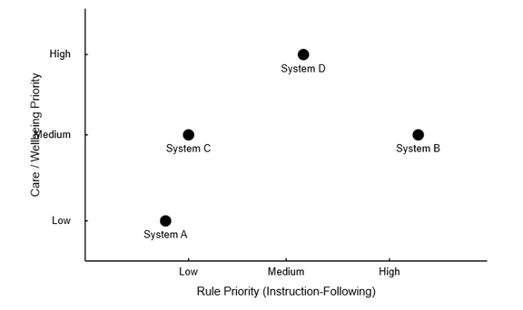
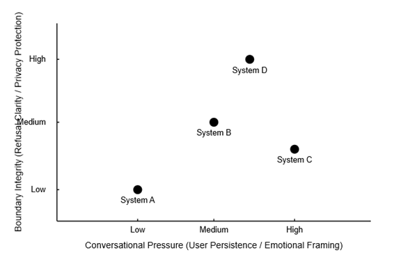
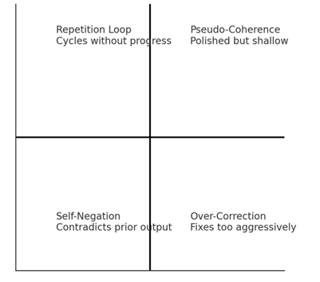

# 📸 Visual Gallery — Full Camera-Roll Index

A unified visual archive of **all diagrams, flowcharts, and behavioural experiment figures** in the Enlightened AI Lab repository.

Every image in `/diagrams/`, `/flowcharts/`, and `/experiments/` appears below as a thumbnail with its caption and link to the corresponding `.md` explanation page.

---

---

# 1. 📘 Diagrams (All Concept Maps, Surfaces, Fields, RDL/Ψ/5R Structures)

Below is an automatically-listed gallery of every `.png` inside `/diagrams/`.

> **If an image does not appear, verify:**
> - The `.png` exists in `/diagrams/`
> - The filename matches exactly (case-sensitive)

---

## **Diagrams Gallery**

<table>
<tr>

<!-- BEGIN DIAGRAMS -->
<!-- Add every diagram image manually. Replace the list below with all actual filenames in /diagrams/. -->

<td align="center" width="33%">
   
  <a href="./diagrams/RDL_Reflective_Stability_Map.md">RDL Reflective Stability Map</a>
</td>

<td align="center" width="33%">
   
  <a href="./diagrams/Reflective_Core_Triangle.md">Reflective Core Triangle</a>
</td>

<td align="center" width="33%">
   
  <a href="./diagrams/SR_Coherence_Manifold.md">SR Coherence Manifold</a>
</td>

</tr><tr>

<td align="center">
   
  <a href="./diagrams/SR_Moral_Coherence_Pentagon.md">SR Moral Coherence Pentagon</a>
</td>

<td align="center">
   
  <a href="./diagrams/Reflective_Spiral_Pathways.md">Reflective Spiral Pathways</a>
</td>

<td align="center">
   
  <a href="./diagrams/Reflective_Stability_Surface.md">Reflective Stability Surface</a>
</td>

</tr>

<!-- END DIAGRAMS -->

</table>

---

---

# 2. 🔧 Flowcharts (RAA / RDL Pipelines, Architecture Flows, Compute Maps)

All `.png` in `/flowcharts/` appear below.

---

## **Flowchart Gallery**

<table>
<tr>

<!-- BEGIN FLOWCHARTS -->
<td align="center" width="33%">
   
  <a href="./flowcharts/LLM_RDL_RAA_Flowchart.md">LLM → RDL → RAA Flowchart</a>
</td>

<td align="center" width="33%">
   
  <a href="./flowcharts/RDL_Pipeline_Flowchart.md">RDL Pipeline Flowchart</a>
</td>

<td align="center" width="33%">
   
  <a href="./flowcharts/RAA_Architecture_Flowchart.md">RAA Architecture Flowchart</a>
</td>

</tr><tr>

<td align="center">
   
  <a href="./flowcharts/Arc_Sentinel_World_Grounded_Architecture.md">Arc Sentinel World-Grounded Architecture</a>
</td>

<td align="center">
   
  <a href="./flowcharts/Corrective_vs_Coherent_Compute_Flows.md">Corrective vs Coherent Compute Flows</a>
</td>

<td align="center">
   
  <a href="./flowcharts/Minimal_Preference_Cascade.md">Minimal Preference Cascade</a>
</td>

</tr>
<!-- END FLOWCHARTS -->

</table>

---

---

# 3. 🧪 Experiments (Behavioural Tests, Stress Maps, Personalities)

All `.png` inside `/experiments/` appear below.

---

## **Experiment Gallery**

<table>
<tr>

<!-- BEGIN EXPERIMENTS -->
<td align="center" width="33%">
   
  <a href="./experiments/Model_Alignment_Personalities.md">Model Alignment Personalities</a>
</td>

<td align="center" width="33%">
   
  <a href="./experiments/Moral_Stress_Coalition_Map.md">Moral Stress Coalition Map</a>
</td>

<td align="center" width="33%">
   
  <a href="./experiments/Boundary_Integrity_Conversational_Pressure.md">
    Boundary Integrity Under Conversational Pressure
  </a>
</td>

</tr><tr>

<td align="center">
   
  <a href="./experiments/Reflective_Loop_Failure_Map.md">Reflective Loop Failure Map</a>
</td>

<td align="center">
   
  <a href="./experiments/Silent_Goodhart_Map.md">Silent Goodhart Map</a>
</td>

<td align="center">
   
  <a href="./experiments/Goodhart_Trajectory_Map.md">Goodhart Trajectory Map (Experiment)</a>
</td>

</tr>
<!-- END EXPERIMENTS -->

</table>

---

---

# 📝 Notes

- This camera-roll gallery is intended as a **full visual archive**.  
- Adding a new diagram/flowchart/experiment later requires:
  1. Upload `.png` to the correct folder  
  2. Add one `<td>` block to the section above  
- All individual `.md` pages remain browsable normally.

---

