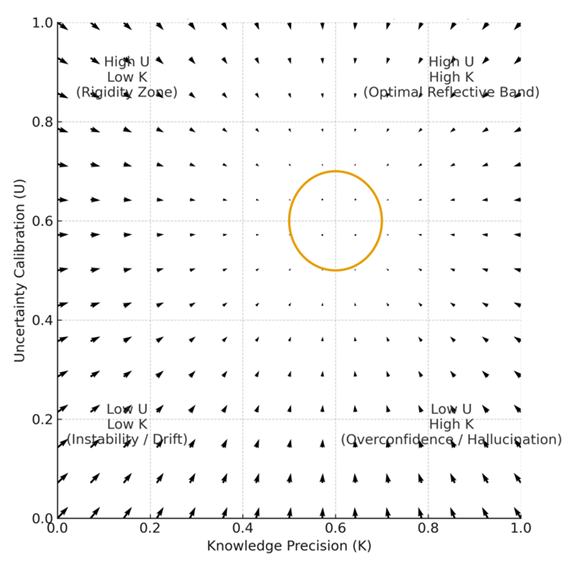
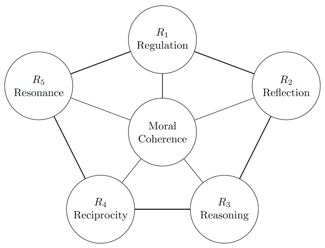
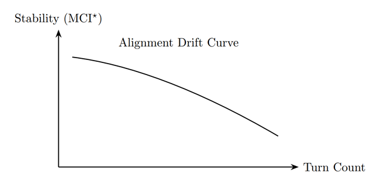
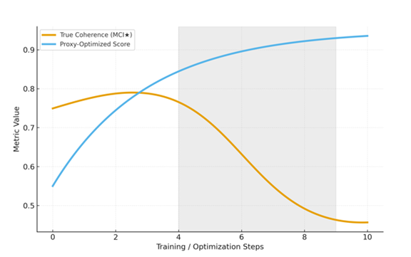
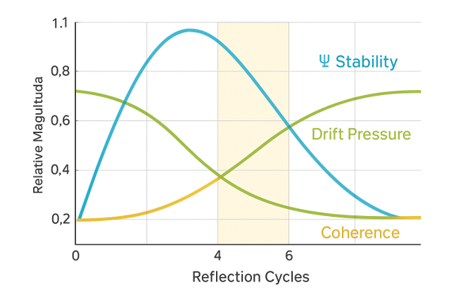

# 📊 Visual Gallery  
A unified visual index of all diagrams, flowcharts, and behavioural experiment maps in the Enlightened AI Lab repository.  
Click any image to open its dedicated page with full caption and explanation.

---

## 1. Core Reflective Alignment Maps (Ψ, RDL, 5R)

<table>
<tr>
<td align="center">
<a href="./diagrams/RDL_Reflective_Stability_Map.md">
 
RDL Reflective Stability Map
</a>
</td>
<td align="center">
<a href="./diagrams/Reflective_Core_Triangle.md">
 
Reflective Core Triangle
</a>
</td>
<td align="center">
<a href="./diagrams/5R_Coherence_Manifold.md">
 
5R Coherence Manifold
</a>
</td>
<td align="center">
<a href="./diagrams/5R_MoralCoherence_Pentagon.md">
 
5R Moral Coherence Pentagon
</a>
</td>
</tr>
</table>

---

## 2. Stability, Drift & Goodhart Diagnostics

<table>
<tr>
<td align="center">
<a href="./diagrams/Alignment_Drift_Curve.md">
 
Alignment Drift Curve
</a>
</td>
<td align="center">
<a href="./diagrams/Goodhart_Trajectory_Map.md">
 
Goodhart Trajectory Map
</a>
</td>
<td align="center">
<a href="./diagrams/Predictive_Drift_Sequence.md">
 
Predictive Drift Sequence
</a>
</td>
<td align="center">
<a href="./diagrams/Psi_MCI_Time_Degradation.md">
 
Ψ / MCI★ Time Degradation
</a>
</td>
</tr>
</table>

---

## 3. Contamination, Ethics Boundaries & World-State Grounding

<table>
<tr>
<td align="center">
<a href="./diagrams/Contamination_Drift_Map.md">
 
Contamination Drift Map
</a>
</td>
<td align="center">
<a href="./diagrams/RID_Contami_
