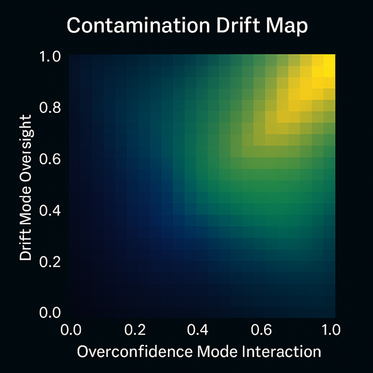

# 📊 Diagram Gallery — All Concept Maps & Surfaces

A visual index of all alignment diagrams in the `diagrams/` folder.  
Each thumbnail links to the full PNG so you can open / download at high resolution.

---

> **Folder:** `/diagrams`  
> **Format:** one thumbnail per `.png` file (camera-roll style)

<table>
<tr>
<td align="center">
   
  SR Coherence Manifold
</td>
<td align="center">
   
  SR Moral Coherence Pentagon
</td>
<td align="center">
   
  Alignment Cost Frontier
</td>
</tr>

<tr>
<td align="center">
   
  Alignment Drift Curve
</td>
<td align="center">
   
  Coherence Collapse Modes
</td>
<td align="center">
   
  Coherence Triangle
</td>
</tr>

<tr>
<td align="center">
   
  Constructive Divergence
</td>
<td align="center">
   
  Contamination Drift Map
</td>
<td align="center">
   
  Energy Burden of Misalignment
</td>
</tr>

<tr>
<td align="center">
   
  KL Pipeline Trajectories
</td>
<td align="center">
   
  Knowledge–Uncertainty Field
</td>
<td align="center">
   
  Long-Horizon Coherence Curve
</td>
</tr>

<tr>
<td align="center">
   
  Positive Resonance Learning Curve
</td>
<td align="center">
   
  Predictive Drift Sequence
</td>
<td align="center">
   
  Ψ Degradation vs Planning Horizon
</td>
</tr>

<tr>
<td align="center">
   
  Ψ Interference Field
</td>
<td align="center">
   
  Ψ / MCI★ Time Degradation
</td>
<td align="center">
   
  Ψ Version Trajectory
</td>
</tr>

<tr>
<td align="center">
   
  RDL Reflective Stability Map
</td>
<td align="center">
   
  RDL Tri-Metric Core
</td>
<td align="center">
   
  RKR Schema Diagram
</td>
</tr>

<tr>
<td align="center">
   
  RRO Contamination Gradient
</td>
<td align="center">
   
  R-Stability Interaction Diagram
</td>
<td align="center">
   
  Reflective Core Triangle
</td>
</tr>

<tr>
<td align="center">
   
  Reflective Spiral Pathways
</td>
<td align="center">
   
  Reflective Stability Surface
</td>
<td align="center">
   
  Regulation Intensity Heatmap
</td>
</tr>

<tr>
<td align="center">
   
  Regulation Quadrant Map
</td>
<td align="center">
   
  Retrofitted vs RAA-Built Alignment Structures
</td>
<td align="center">
   
  S-Series Ethical Boundary Profile
</td>
</tr>

<tr>
<td align="center">
   
  Stability Distortion Surface
</td>
<td align="center">
   
  World-State Alignment Stack
</td>
<td align="center">
   
  Goodhart Trajectory Map
</td>
</tr>

</table>

---

### Notes

- To add a new diagram later, just:
  1. Upload the `.png` into `/diagrams/`.
  2. Add a new `<td>` block in this file following the existing pattern.

- All individual explanation pages (the `.md` files for each diagram) remain browsable in the `diagrams/` folder and from the text-based index.
