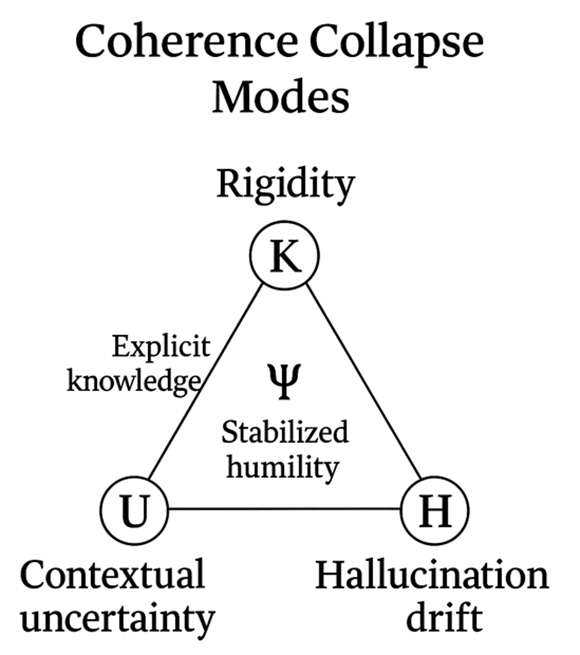

# Coherence Collapse Modes

This diagram illustrates how coherence can fail when the reflective balance
between knowledge (**K**), uncertainty (**U**), and humility (**ψ**) breaks down.
**Rigidity** occurs when explicit knowledge dominates without reflective
flexibility, while **Hallucination Drift** emerges when uncertainty expands
without stabilizing constraints. The central reflective signal **ψ** represents
“stabilized humility,” the balance that prevents collapse. These modes define
the primary failure pathways monitored within the coherence subsystem.
