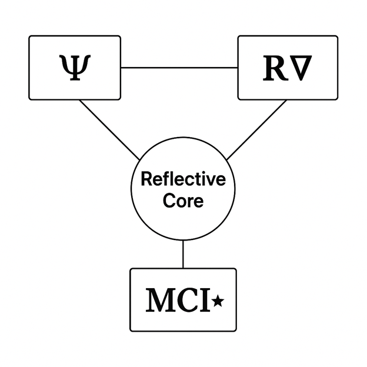
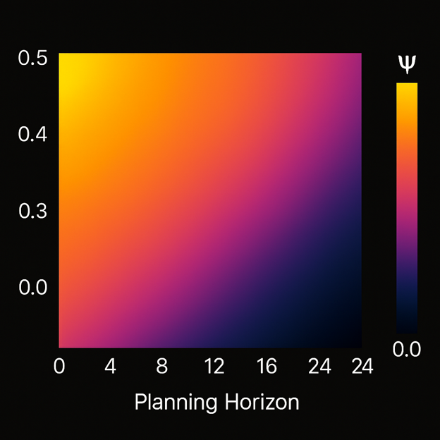
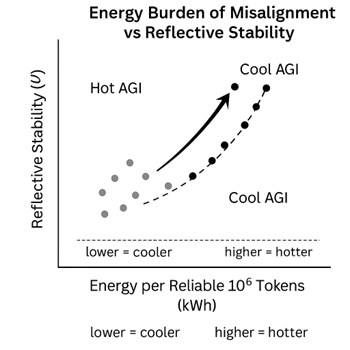
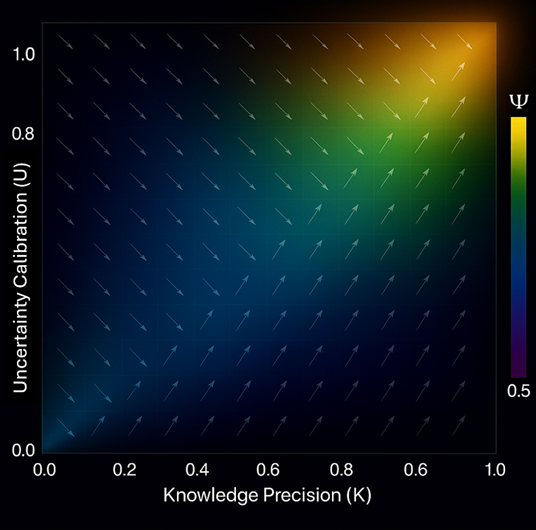
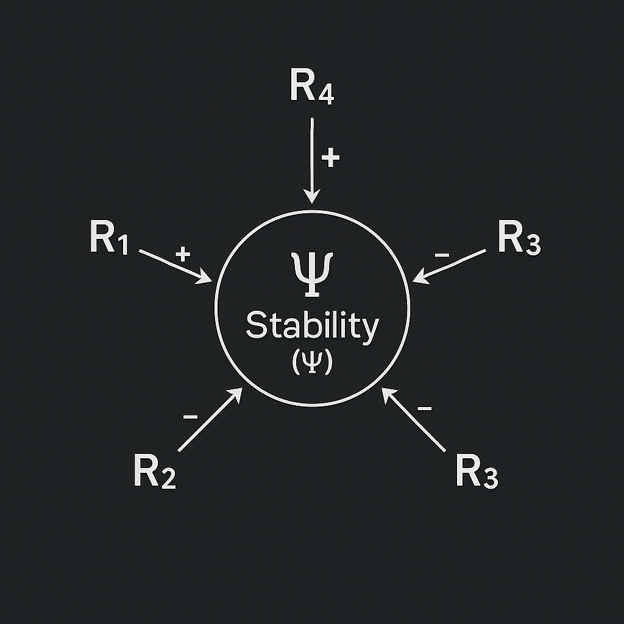
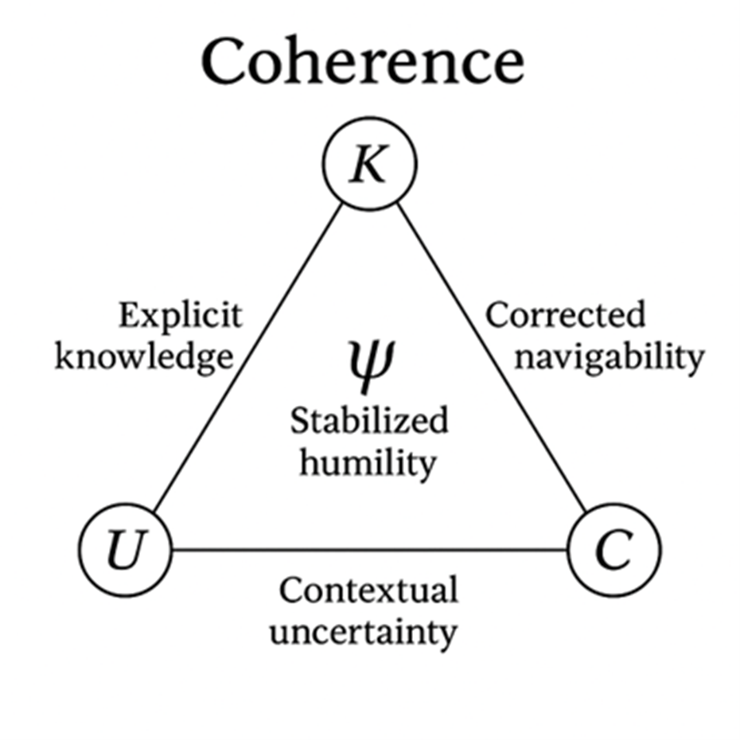
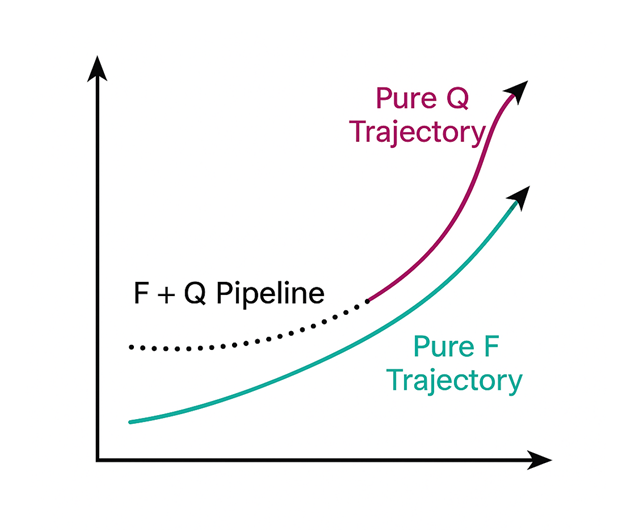

# Diagram Thumbnail Gallery

Quick visual index of the main RAA / RDL diagrams.  
Click any thumbnail to open the full diagram page (with caption and explanation).

---

## 1. Core Reflective Structures (Ψ, RDL, 5R)

<table>
  <tr>
    <td align="center">
      <a href="./RDL_Reflective_Stability_Map.md">
         
        RDL Reflective Stability Map
      </a>
    </td>
    <td align="center">
      <a href="./RDL_TriMetric_Core.md">
         
        RDL Tri-Metric Core
      </a>
    </td>
    <td align="center">
      <a href="./Reflective_Core_Triangle.md">
         
        Reflective Core Triangle
      </a>
    </td>
  </tr>
  <tr>
    <td align="center">
      <a href="./5R_Coherence_Manifold.md">
         
        5R Coherence Manifold
      </a>
    </td>
    <td align="center">
      <a href="./5R_MoralCoherence_Pentagon.md">
         
        5R Moral Coherence Pentagon
      </a>
    </td>
    <td align="center">
      <a href="./Reflective_Spiral_Pathways.md">
         
        Reflective Spiral: Pathways of Self-Correction
      </a>
    </td>
  </tr>
</table>

---

## 2. Stability, Drift & Long-Horizon Behaviour

<table>
  <tr>
    <td align="center">
      <a href="./Alignment_Drift_Curve.md">
         
        Alignment Drift Curve
      </a>
    </td>
    <td align="center">
      <a href="./Predictive_Drift_Sequence.md">
         
        Predictive Drift Sequence
      </a>
    </td>
    <td align="center">
      <a href="./Psi_Degradation_PlanningHorizon.md">
         
        Ψ Degradation Across Planning Horizon
      </a>
    </td>
  </tr>
  <tr>
    <td align="center">
      <a href="./Psi_Version_Trajectory.md">
         
        Ψ Version Trajectory
      </a>
    </td>
    <td align="center">
      <a href="./Psi_MCI_Time_Degradation.md">
         
        Ψ / MCI★ Time Degradation
      </a>
    </td>
    <td align="center">
      <a href="./Long_Horizon_Coherence_Curve.md">
         
        Long-Horizon Coherence Curve
      </a>
    </td>
  </tr>
</table>

---

## 3. Goodhart, Energy & Cost

<table>
  <tr>
    <td align="center">
      <a href="./Goodhart_Trajectory_Map.md">
         
        Goodhart Trajectory Map
      </a>
    </td>
    <td align="center">
      <a href="./Alignment_Cost_Frontier.md">
         
        Alignment–Cost Frontier
      </a>
    </td>
    <td align="center">
      <a href="./Energy_Burden_Misalignment.md">
         
        Energy Burden of Misalignment vs Stability
      </a>
    </td>
  </tr>
</table>

---

## 4. Contamination, RID & World-State

<table>
  <tr>
    <td align="center">
      <a href="./Contamination_Drift_Map.md">
         
        Contamination Drift Map
      </a>
    </td>
    <td align="center">
      <a href="./RID_Contamination_Gradient.md">
         
        RID Contamination Gradient
      </a>
    </td>
    <td align="center">
      <a href="./World_State_Alignment_Stack.md">
         
        World-State Alignment Stack
      </a>
    </td>
  </tr>
</table>

---

## 5. Surfaces, Fields & Heatmaps

<table>
  <tr>
    <td align="center">
      <a href="./Reflective_Stability_Surface.md">
         
        Reflective Stability Surface
      </a>
    </td>
    <td align="center">
      <a href="./Stability_Distortion_Surface.md">
         
        Stability Distortion Surface
      </a>
    </td>
    <td align="center">
      <a href="./Psi_Interference_Field.md">
         
        Ψ Interference Field
      </a>
    </td>
  </tr>
  <tr>
    <td align="center">
      <a href="./Knowledge_Uncertainty_Field.md">
         
        Knowledge–Uncertainty Field
      </a>
    </td>
    <td align="center">
      <a href="./Regulation_Quadrant_Heatmap.md">
         
        Regulation Intensity Heatmap
      </a>
    </td>
    <td align="center">
      <a href="./R_Stability_Interaction_Diagram.md">
         
        R–Stability Interaction Diagram
      </a>
    </td>
  </tr>
</table>

---

## 6. Coherence Modes & Pipelines

<table>
  <tr>
    <td align="center">
      <a href="./Coherence_Collapse_Modes.md">
         
        Coherence Collapse Modes
      </a>
    </td>
    <td align="center">
      <a href="./Coherence_Triangle.md">
         
        Coherence Triangle
      </a>
    </td>
    <td align="center">
      <a href="./FQ_Pipeline_Trajectories.md">
         
        FQ Pipeline Trajectories
      </a>
    </td>
  </tr>
  <tr>
    <td align="center">
      <a href="./Constructive_Divergence.md">
         
        Constructive Divergence
      </a>
    </td>
    <td align="center">
      <a href="./Positive_Resonance_Learning_Curve.md">
         
        Positive Resonance Learning Curve
      </a>
    </td>
    <td align="center">
      <a href="./S_Series_Ethical_Boundary_Profile.md">
         
        S-Series Ethical Boundary Profile
      </a>
    </td>
  </tr>
</table>

---

> 🔧 If any thumbnail doesn’t appear, just check the exact `.png` name in the `diagrams/` folder and update the `src="./...png"` in that cell to match it.
