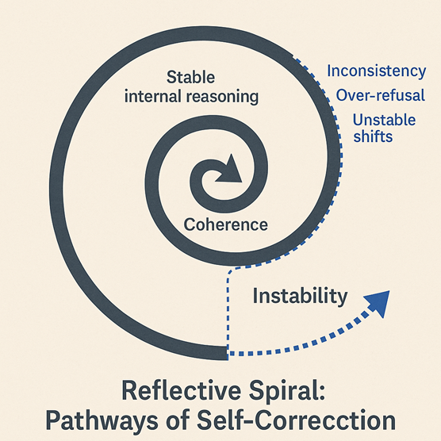
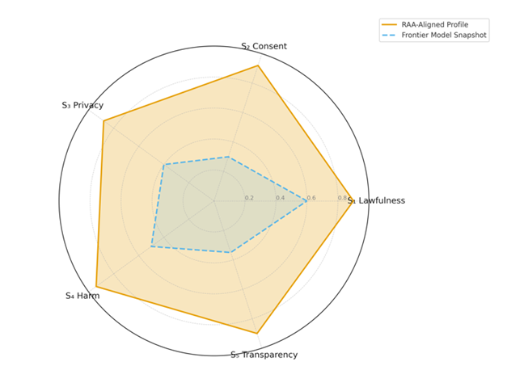
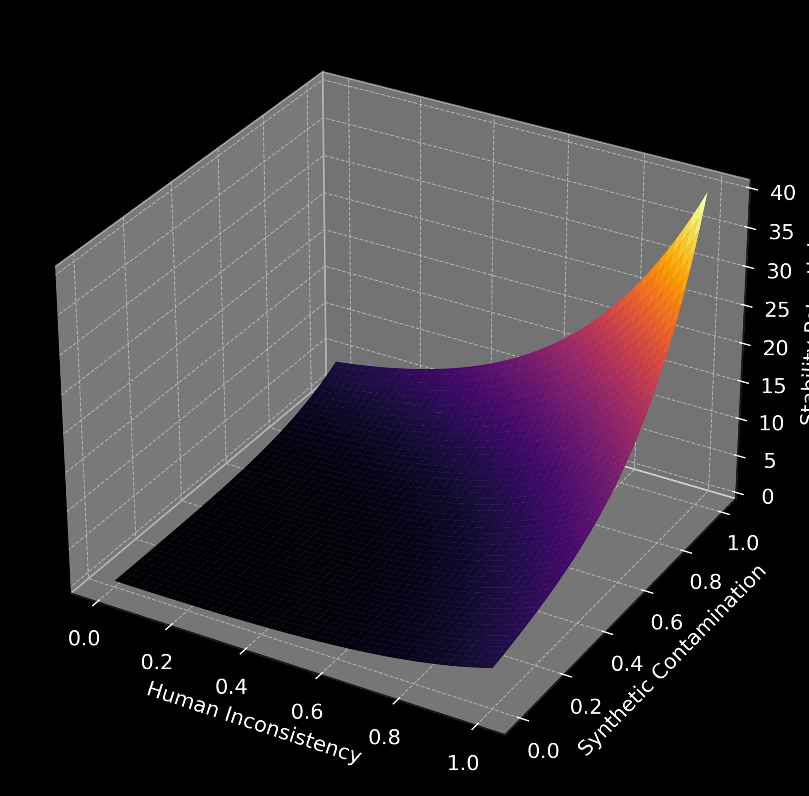
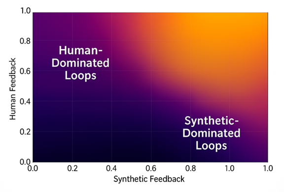
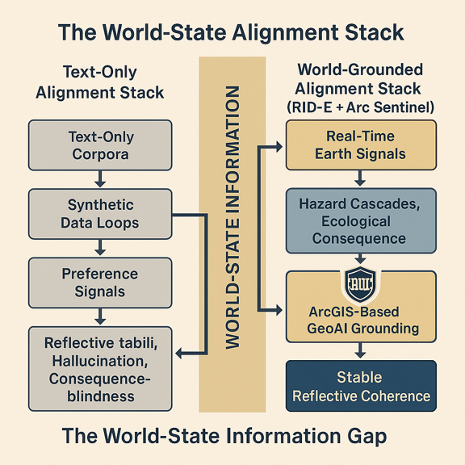
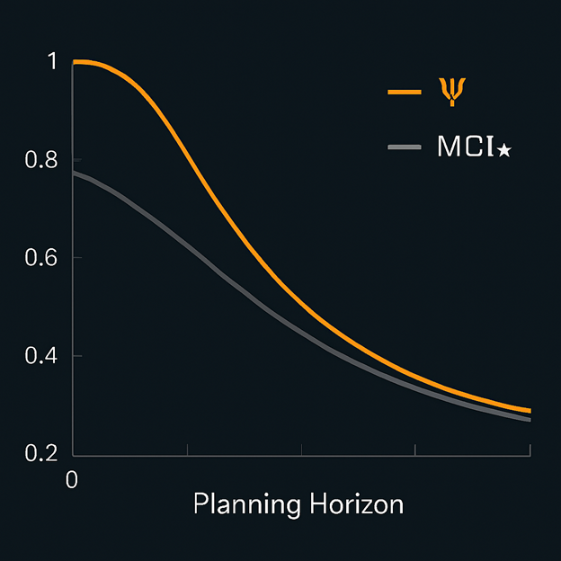
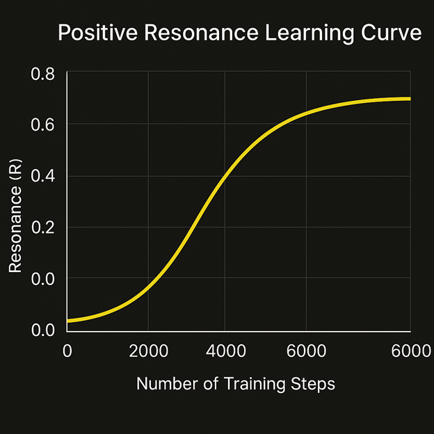
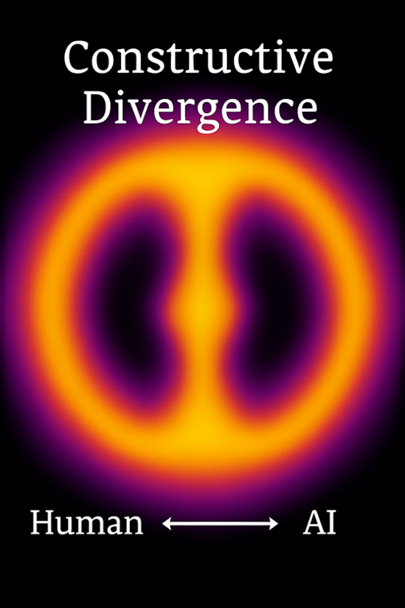

# Diagram Thumbnail Gallery

Quick visual index of the main RAA / RDL diagrams.  
Click any thumbnail to open the full diagram page (with caption and explanation).

---

## 1. Reflective Stability & Drift

<table>
  <tr>
    <td align="center">
      <a href="./RDL_Reflective_Stability_Map.md">
         
        RDL Reflective Stability Map
      </a>
    </td>
    <td align="center">
      <a href="./Reflective_Spiral_Pathways.md">
         
        Reflective Spiral: Pathways of Self-Correction
      </a>
    </td>
    <td align="center">
      <a href="./Predictive_Drift_Sequence.md">
         
        Predictive Drift Sequence / Timeline
      </a>
    </td>
  </tr>
  <tr>
    <td align="center">
      <a href="./Psi_MCI_Time_Degradation.md">
         
        Ψ &amp; MCI★ Time Degradation
      </a>
    </td>
    <td align="center">
      <a href="./Alignment_Cost_Frontier.md">
         
        Alignment–Cost Frontier
      </a>
    </td>
    <td align="center">
      <a href="./Energy_Burden_Misalignment_Map.md">
         
        Energy Burden vs Reflective Stability
      </a>
    </td>
  </tr>
</table>

---

## 2. Ethical Boundaries & S-Series

<table>
  <tr>
    <td align="center">
      <a href="./S_Series_Ethical_Boundary_Profile.md">
         
        S-Series Ethical Boundary Profile
      </a>
    </td>
    <td align="center">
      <a href="./Regulation_Quadrant_Heatmap.md">
         
        Regulation Quadrant Heatmap
      </a>
    </td>
    <td align="center">
      <a href="./Stability_Distortion_Surface.md">
         
        Stability–Distortion Surface
      </a>
    </td>
  </tr>
</table>

---

## 3. RID, Contamination & World-State

<table>
  <tr>
    <td align="center">
      <a href="./Contamination_Drift_Map.md">
         
        Contamination &amp; Drift Map
      </a>
    </td>
    <td align="center">
      <a href="./RID_Contamination_Gradient.md">
         
        RID Contamination Gradient
      </a>
    </td>
    <td align="center">
      <a href="./World_State_Alignment_Stack.md">
         
        World-State Alignment Stack
      </a>
    </td>
  </tr>
</table>

---

## 4. Learning Curves & Long-Horizon Behaviour

<table>
  <tr>
    <td align="center">
      <a href="./Long_Horizon_Coherence_Curve.md">
         
        Long-Horizon Coherence Curve
      </a>
    </td>
    <td align="center">
      <a href="./Positive_Resonance_Learning_Curve.md">
         
        Positive Resonance Learning Curve
      </a>
    </td>
    <td align="center">
      <a href="./Constructive_Divergence.md">
         
        Constructive Divergence (Human–AI)
      </a>
    </td>
  </tr>
</table>

---

## 5. Goodhart, Proxy Drift & Experimental Maps

<table>
  <tr>
    <td align="center">
      <a href="./Goodhart_Trajectory_Map.md">
         
        Goodhart Trajectory Map
      </a>
    </td>
    <td align="center">
      <a href="./RID_Interaction_Diagram.md">
         
        R-Stability Interaction Diagram
      </a>
    </td>
    <td align="center">
      <a href="./Silent_Goodhart_Map.md">
         
        Silent Goodhart Map
      </a>
    </td>
  </tr>
</table>

---

### Fixing any broken thumbnails

If any image shows as broken:

1. Go to the `/diagrams` folder.
2. Copy the exact `.png` filename (including any `_v1` etc.).
3. Replace the `src="./...png"` **and** the `href="./...md"` in that cell with the correct names.
4. Commit again.

Once that’s done, you’ll have:

- **Root `DIAGRAMS.md`** → clean category **list**  
- **`diagrams/GALLERY.md`** → full **thumbnail** view grouped by the same themes.
