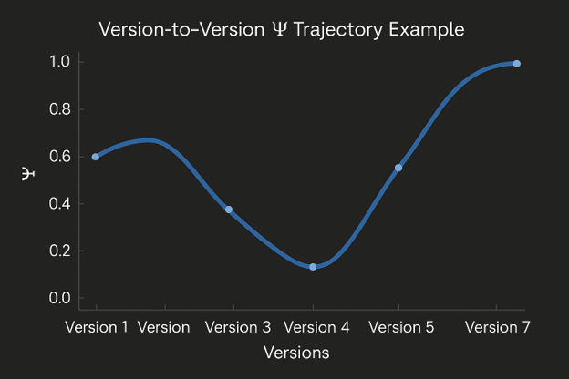

# Version-to-Version Ψ Trajectory Example

This chart illustrates how reflective stability (Ψ) evolves across successive
model versions. The trajectory shows dips, recoveries, and long-horizon
stabilization patterns that are often invisible when evaluating any single
version in isolation. Monitoring Ψ across versions helps identify regression,
improvement, and structural shifts in long-range coherence.

