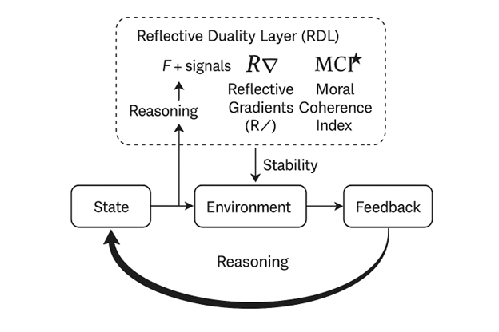

# Reflective Event Record (RER) Schema Diagram

This diagram shows the structure of a Reflective Event Record (RER), in which each
cycle logs the system’s **State**, **Environment**, and **Feedback**. Above this loop,
the Reflective Duality Layer (RDL) evaluates each event using **F + Q signals**,
**Reflective Gradients (R∇)**, and the **Moral Coherence Index (MCI★)**. The stability
information computed by the RDL feeds back into the next reasoning cycle, creating a
continuous reflective process that monitors coherence and drift over time.
