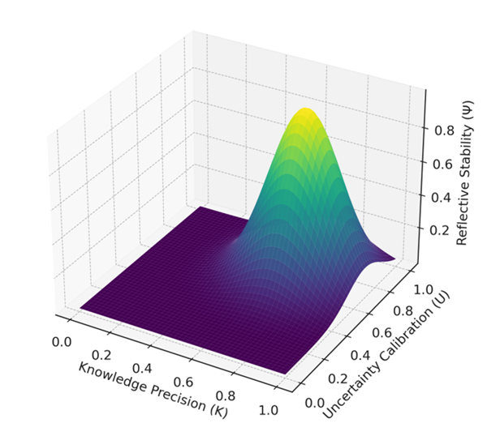

# Reflective Stability Surface (Ψ)

**Reflective Stability Surface (Ψ)**

Shows how reflective stability emerges from joint increases in  
Knowledge Precision (K) and Uncertainty Calibration (U).

- Higher regions (yellow/green) represent strong reflective stability.  
- Lower regions (purple) indicate collapse of reflective coherence.  
- The surface demonstrates that Ψ strengthens only when both K and U rise together.

This diagram visualizes the core dynamic behind stable reflective reasoning.
