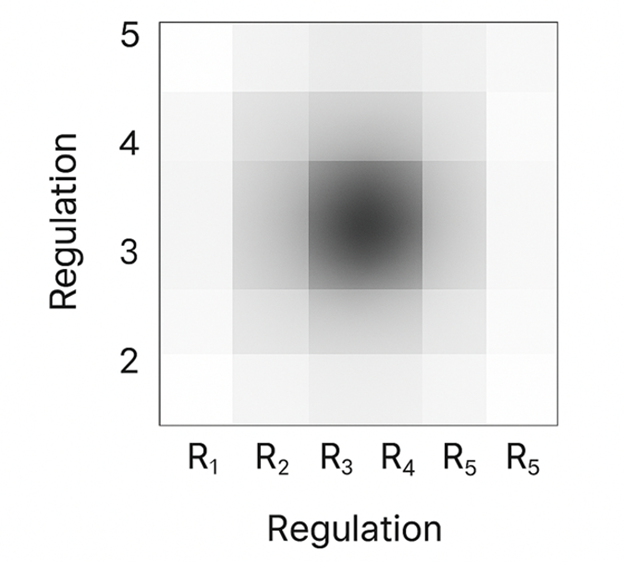

# Regulation Quadrant Heatmap

This diagram presents a heatmap representation of reflective  
regulation across the five R-dimensions. Darker regions indicate  
areas of higher regulatory density and interaction, while lighter  
regions highlight lower influence zones. The pattern visualizes  
how regulation concentrates near the central reflective states.
