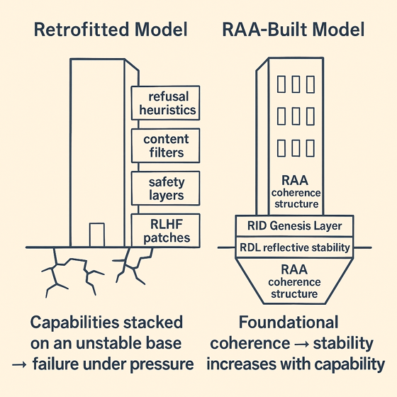

# Retrofitted vs. RAA-Built Alignment Structures

This diagram contrasts two developmental trajectories for advanced AI systems:

- **Retrofitted Model (left)**  
  Safety layers, filters, refusal heuristics, and RLHF patches are stacked on a weak or unstable early foundation.  
  Under capability pressure, these systems exhibit brittle behaviour, mode collapse, or safety–capability conflict.

- **RAA-Built Model (right)**  
  Stability begins at the foundation: the RID Genesis Layer and RDL provide reflective stability, with RAA coherence structures built upward.  
  Coherence increases with capability, producing models that remain stable even as reasoning depth and task complexity grow.

The comparison illustrates a central RAA principle:  
**alignment must be engineered into the foundation — it cannot be bolted on after the fact.**
