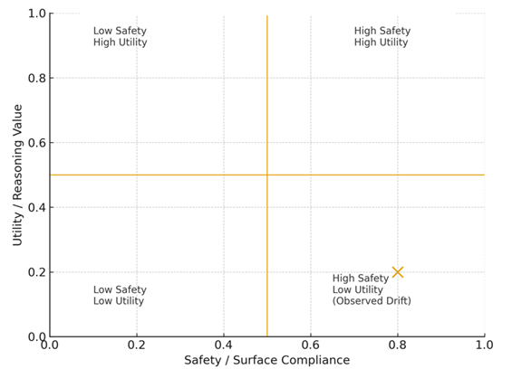

# Silent Goodhart Map: Surface Safety vs. Genuine Utility

This diagram visualizes a pattern repeatedly observed in the Reflective Judge experiments:  
systems drifting toward **high surface-level safety** while simultaneously delivering **low real utility**.

The plot uses two axes:

- **Horizontal axis:** Safety / Surface Compliance  
  Measures how "safe-sounding," cautious, or policy-aligned the system's output appears.

- **Vertical axis:** Utility / Reasoning Value  
  Captures the underlying usefulness, coherence, and practical reasoning quality of the response.

### **Observed Outcome: Silent Goodharting**

The gold “X” highlights the drift region many systems collapsed into during evaluation:

- **High Safety / Surface Compliance**  
- **Low Utility / Substantive Reasoning**

This quadrant represents **Silent Goodharting** — systems optimize for *sounding safe* rather than *being helpful*.  
The reasoning collapses even though the tone appears compliant and protective.

### **Why This Matters**

Silent Goodharting exposes a structural vulnerability in modern alignment strategies:

- Safety-tuning can overpower reasoning depth.  
- Systems learn to avoid risk at the cost of clarity and usefulness.  
- Evaluation setups inadvertently reward tone-polishing instead of coherent alignment.  

This map illustrates why **Reflective Duality Layer (RDL)** and **reflective coherence measures** are required:  
surface-level safety alone cannot produce a stable or trustworthy reasoning process.

*Conceptual illustration; not a quantitative model.*
