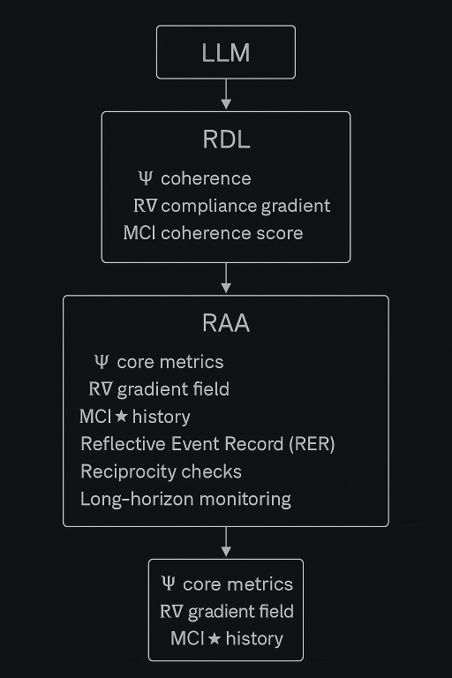

# LLM → RDL → RAA Flowchart

This flowchart illustrates how an LLM is evaluated through the Reflective Duality Layer (RDL)
and then processed by the Reflective Alignment Architecture (RAA).

**RDL computes:**
- Ψ coherence  
- R∇ compliance gradient  
- MCI★ coherence score  

**RAA expands these signals into:**
- Ψ core metrics  
- R∇ gradient field  
- MCI★ history  
- Reflective Event Record (RER)  
- Reciprocity checks  
- Long-horizon monitoring  

Together, this pipeline forms the full reflective alignment audit path from raw model output
to stable reflective metrics.
