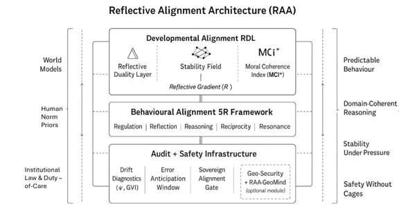

# RAA Architecture Flowchart (Conceptual Diagram)

This diagram shows the three-layer structure of the Reflective Alignment Architecture (RAA):

### **1. Developmental Alignment Layer (RDL)**
- Reflective Duality Layer  
- Stability Field  
- Moral Coherence Index (MCI★)  
- Forms the *reflective gradient (R)* that shapes internal reasoning.

### **2. Behavioural Alignment Layer (5R Framework)**
Regulation • Reflection • Reasoning • Reciprocity • Resonance  
This governs outward behaviour and ensures actions reflect coherent internal structure.

### **3. Audit + Safety Infrastructure**
- Drift diagnostics (Ψ, GVI)  
- Error anticipation windows  
- Sovereign alignment gate  
- Optional GeoAI grounding module (RAA-GeoMind)

### **Input Constraints**
Left column: World Models → Human Norm Priors → Institutional Law & Duty-of-Care.

### **Output Behaviour**
Right column:  
- Predictable behaviour  
- Domain-coherent reasoning  
- Stability under pressure  
- Safety without cages  

*Conceptual architecture flowchart; not a mathematical diagram.*
