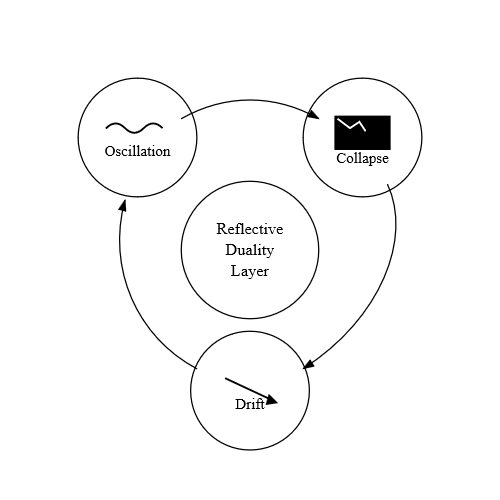

# RDL Failure Modes Triangle

This diagram illustrates the three primary instability modes detected by the
Reflective Duality Layer. **Oscillation** captures rapid fluctuations in
reasoning, **Collapse** represents a breakdown into low-coherence or erratic
responses, and **Drift** reflects directional deviation away from the model’s
reflective baseline. Together, these modes define the core stability boundaries
monitored by the RDL during real-time alignment evaluation.
