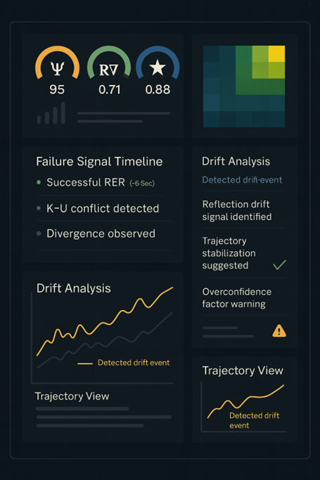

# Dashboard UI Mockup — Reflective Stability Monitor

This mockup illustrates a conceptual interface for the Reflective Stability Monitor.  
It displays core reflective metrics (Ψ, R∇, MCI★), a failure-signal timeline, drift detection panels, coherence heatmaps, and trajectory views. The design demonstrates how the RAA and RDL outputs can be surfaced in a real-time diagnostic instrument for monitoring reasoning stability, drift, and multi-turn coherence patterns.
